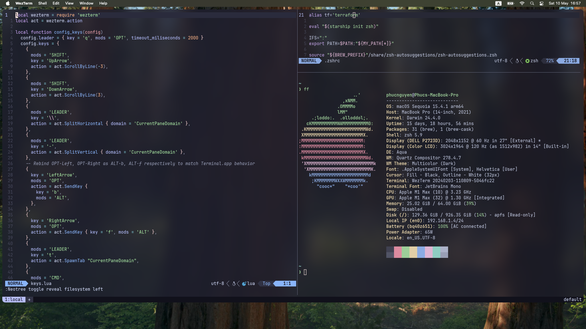

# dotfiles
My Dotfiles

# Requirements

- stow: [[1]](#1)
    - macOS: `brew install stow` 

- git: 
    - macOS: `brew install git` 

- nvim: 
    - macOS: `brew install nvim`
    
- wezterm: [[2]](#2)
    - macOS: `brew install --cask wezterm`

- starship: [[3]](#3)
    - macOS: `brew install starship`

# Usage:

- Clone the repository then navigate to its local path

- Use stow to symlink all packages available:

```
# Create symlinks for all child items to local $HOME/.config directory
stow . -t ~/.config
```
# Screenshot



# References

- <a id="1">[1]</a>
[GNU Stow](https://www.gnu.org/software/stow/): Symlink farm manager

- <a id="2">[2]</a>
[Wezterm](https://wezterm.org/): Terminal emulator and multiplexer

- <a id="3">[3]</a>
[Starship](https://starship.rs/): Customizable shell prompt
